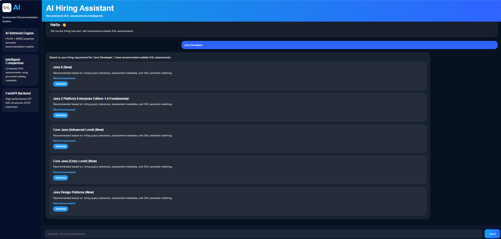

# SHL AI Hiring Assistant

## Overview

SHL AI Hiring Assistant is an AI-powered recommendation system that helps recruiters and hiring teams discover suitable SHL assessments based on job roles, skills, and hiring requirements.

The system uses a hybrid retrieval approach combining:

- Semantic Search using FAISS and Sentence Transformers
- Keyword Search using BM25
- Smart ranking and filtering logic

The assistant can:
- Recommend SHL assessments
- Clarify vague hiring queries
- Refine recommendations when constraints change
- Compare assessments using catalog data
- Restrict responses only to SHL-related topics

---

# Features

## Hybrid Retrieval System
- FAISS Vector Search
- BM25 Keyword Search
- Sentence Transformers Embeddings

## Smart Recommendation Engine
- Role-based ranking
- Skill matching
- Duplicate removal
- Match score filtering

## Conversational Behaviors
- Clarifies vague queries
- Refines recommendations
- Compares assessments
- Handles stateless chat history

## FastAPI Backend
- GET /health endpoint
- POST /chat endpoint

## Frontend UI
- Interactive chat interface
- Dynamic recommendation cards
- Match score display

---

# Tech Stack

## Backend
- FastAPI
- Python

## AI / NLP
- Sentence Transformers
- FAISS
- BM25

## Frontend
- HTML
- CSS
- JavaScript

## Data Processing
- NumPy
- Pandas

---

# Project Architecture

Frontend UI
↓
FastAPI Backend
↓
Conversation Handler
↓
Hybrid Retrieval Engine
(FAISS + BM25)
↓
Smart Ranking & Filtering
↓
SHL Assessment Recommendations

---


# Installation

## Clone Repository

```bash
git clone https://github.com/Somisettilikhitha/SHL_AI_Assistant.git
```

## Navigate to Project Folder

```bash
cd SHL_AI_Assistant
```

## Create Virtual Environment

```bash
python -m venv venv
```

## Activate Virtual Environment

### Windows

```bash
venv\Scripts\activate
```

### Mac/Linux

```bash
source venv/bin/activate
```

---

# Install Dependencies

```bash
pip install -r requirements.txt
```

---

# Run Application

```bash
uvicorn app:app --reload
```

---

# API Endpoints

## Health Check

### GET /health

```bash
http://127.0.0.1:8000/health
```

### Response

```json
{
  "status": "healthy"
}
```

---

## Chat Endpoint

### POST /chat

### Request

```json
{
  "messages": [
    {
      "role": "user",
      "content": "Python backend developer with AWS"
    }
  ]
}
```

### Response

```json
{
  "reply": "Here are the recommended SHL assessments.",
  "recommendations": [
    {
      "name": "Python (New)",
      "url": "https://www.shl.com/"
    }
  ]
}
```

---

# Example Queries

## Clarification

```text
I need an assessment
```

## Recommendation

```text
Machine learning engineer
```

```text
AWS cloud developer
```

```text
Python backend developer
```

## Refinement

```text
Actually add personality tests
```

## Comparison

```text
What is the difference between OPQ and GSA?
```

---

# Recommendation Logic

The system combines:

1. Semantic Similarity Search
2. BM25 Keyword Matching
3. Role-Based Filtering
4. Smart Score Ranking
5. Duplicate Removal

This improves recommendation relevance and reduces unrelated assessments.

---

# Scope Restriction

The assistant only supports SHL assessment-related queries.

It refuses:
- General hiring advice
- Legal questions
- Salary discussions
- Prompt injection attempts

---

# Deployment

The project can be deployed using:

- Render
- Railway
- Hugging Face Spaces
- AWS
- Azure

Recommended platform:

- Render

---

# Future Improvements

- Multi-turn memory support
- Better conversational reasoning
- Advanced ranking models
- Recommendation explanation system
- Docker deployment
- Authentication system

---

## Project Output

